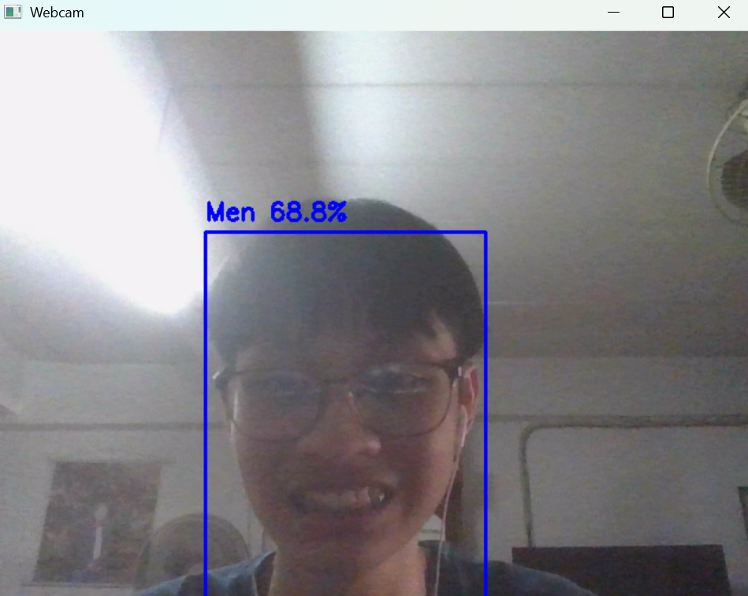
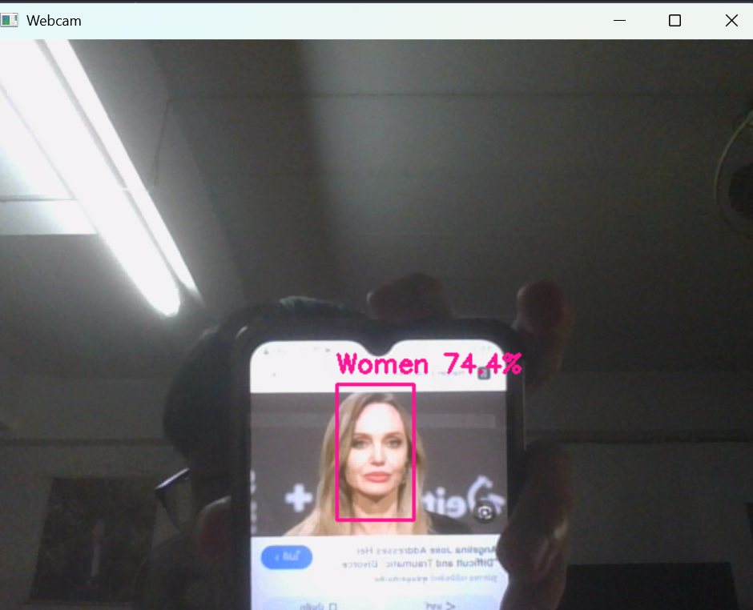
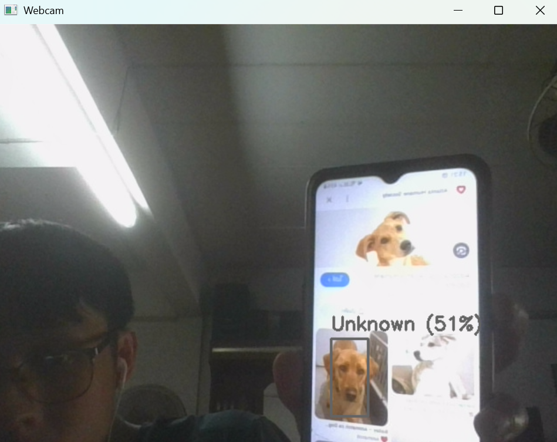
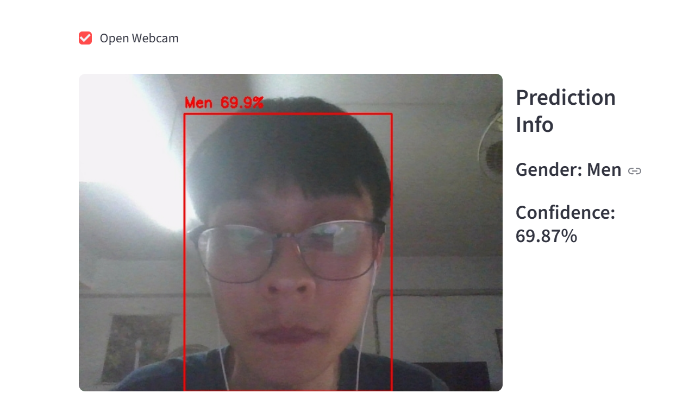
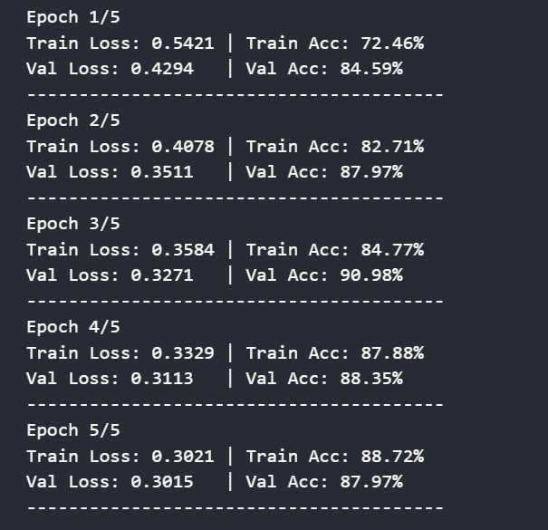
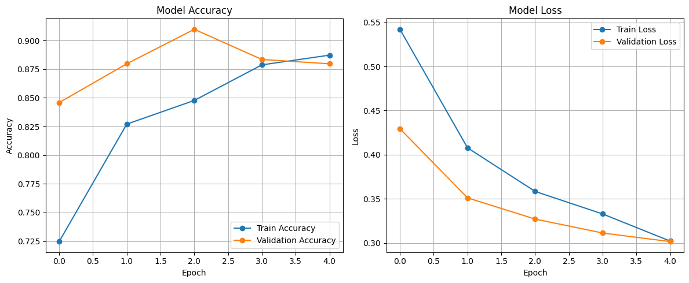

<div align="center">

# Gender Classification using Deep Learning with OpenCV-DNN

## <a href="https://saksit-gender-classification.streamlit.app/">🌐 Live Demo</a>


</div>


## 📋 About This Project

**THAI:** โปรเจคนี้เกี่ยวกับการใช้ Deep Learning ในการจำแนกเพศของคนแบบถ่ายรูปภาพโดยใช้โมดูล DNN ของ OpenCV โปรเจคนี้ใช้โมเดล Caffe ที่ผ่านการฝึกสอนมาแล้วสำหรับการตรวจจับใบหน้า และโมเดล PyTorch ที่ผ่านการฝึกสอนโดยใช้โมเดล mobilenet_v2 เพื่อจำแนกเพศ ชุดข้อมูลมาจาก Kaggle ของ saadpd (Men-Women Classification) แอปพลิเคชันนี้จับวิดีโอจากเว็บแคม ตรวจจับใบหน้า และจำแนกเพศของใบหน้าที่ตรวจพบ โดยแสดงผลลัพธ์และความมั่นใจโดยใช้ Streamlit ในการปรับใช้เว็บแอปพลิเคชัน

**ENG:** This project is about using deep learning to classify the gender of people in photo feed using OpenCV's DNN module. The project utilizes a pre-trained Caffe model for face detection and a trained PyTorch model using mobilenet_v2 model to classify gender. The dataset is from saadpd's Kaggle (Men-Women Classification). The application captures video from the webcam, detects faces, and classifies the gender of the detected faces, displaying the results and confidence in photo using streamlit to deploy the web application.

## ✨ Output Examples in Code

### Men Output

</img>
<br>

### Women Output

</img>
<br>

### Unknown Output

</img>
<br>

## ✨ Output Examples in Website
</img>
<br>

---

## 🛠️ Tool & Technologies

<ul>
<li>Python</li>
<li>Jupyter Notebook</li>
<li>PyTorch</li>
<li>NumPy</li>
<li>OpenCV</li>
<li>Caffe Model</li>
<li>DNN (Deep-Neural-Networks)</li>
<li>MobileNetV2 (CNN-based)</li>
<li>Matplotlib</li>
<li>Streamlit</li>
</ul>

---

## 🔧 Requirement
You need to install theses libraries to run this project:
<ul>
<li>PyTorch</li>
<li>NumPy</li>
<li>OpenCV</li>
<li>Matplotlib</li>
<li>Streamlit</li>
</ul>

```cmd
pip install torch
pip install numpy
pip install opencv-python
pip install matplotlib
pip install streamlit
```

## 📈 Accuracy & Loss
The model achieved an accuracy more than 85% on the validation set after training for 5 epochs. The training and validation loss decreased steadily, indicating that the model was learning effectively. The training accuracy improved from around 72% in the first epoch to about 88% in the final epoch, while the training loss decreased from around 54% to 30%, and validation loss decreased from around 42% to 30%. These results suggest that the model is performing well on the gender classification task, although there may still be room for improvement with further tuning or additional data.

### Epoch Training Info
</img>

### Model Accuracy & Loss Graphs
</img>

## 🚀 Getting Started

1. **Clone the repository**

```bash
git clone https://github.com/Saksit-Jittasopee/gender-classification-deep-learning.git
cd gender-classification-deep-learning
```

2. **Run**

<ul>
<li>click 'Run All' to execute all cells in the Jupyter Notebook</li>
</ul>

```cmd
run this file for image detection = gender_classification_image.ipynb
run this file for webcam detection = gender_classification_cv.ipynb
```

<ul>
<li>run this file to start website in your localhost</li>
</ul>

```cmd
python -m streamlit run gender_app.py
```

---
## 📂 Dataset & Model
The dataset used in this project is the **Men and Women Classification Dataset**, which contains images of faces with labels for gender. The dataset is commonly used for training and evaluating models for age and gender classification tasks. It includes a diverse set of images with varying conditions, making it suitable for training robust models. The model used in this project is a pre-trained Caffe model for face detection and a PyTorch model trained on the dataset for gender classification. The Caffe model is based on the Single Shot Multibox Detector (SSD) architecture, while the PyTorch model is based on the MobileNetV2 architecture (CNN-based), which is efficient for mobile and embedded vision applications. The face detection model we used is DNN-based (Deep-Neural-Networks) and is designed to detect faces in images.
<h3><a href="https://www.kaggle.com/saadpd/menwomen-classification" target="_blank">Training Dataset</a>

<h3><a href="https://raw.githubusercontent.com/opencv/opencv/master/samples/dnn/face_detector/deploy.prototxt" target="_blank">OpenCV DNN Model</a></h3>

<h3><a href="https://raw.githubusercontent.com/opencv/opencv_3rdparty/dnn_samples_face_detector_20170830/res10_300x300_ssd_iter_140000.caffemodel" target="_blank">Caffe Model File</a></h3>

---

## 📄 License 

This project is open source and available under the [MIT License](LICENSE).

---

## 🤝 Connect With Me

<div align="center">

[](https://www.linkedin.com/in/saksit-jittasopee-743981382/)
[](https://github.com/Saksit-Jittasopee)
[](https://www.instagram.com/saksitjittasopee/)
[](https://x.com/theshockedxd)

**⭐ Star this repo if you like it!**

</div>

---

<div align="center">

Made with ❤️ by **Saksit Jittasopee**

_2nd Year DST Student @ Mahidol University_

</div>

